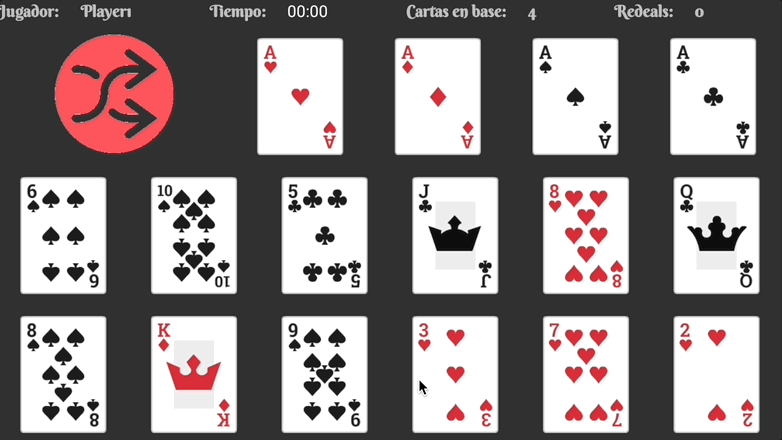
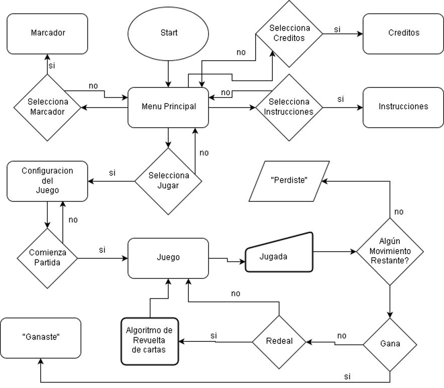
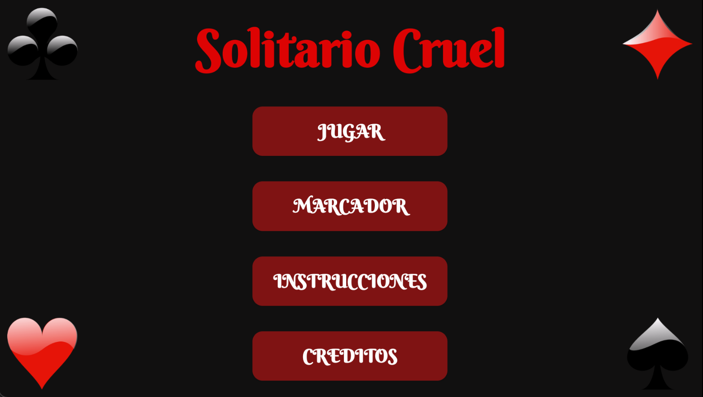
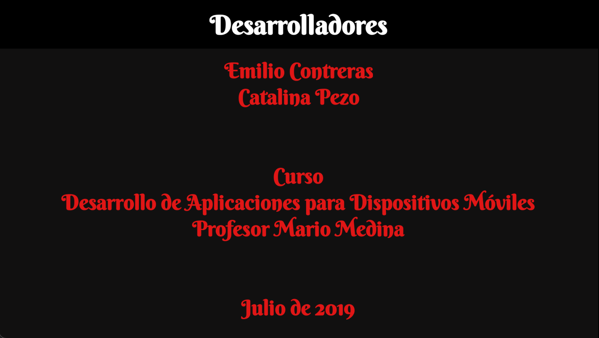
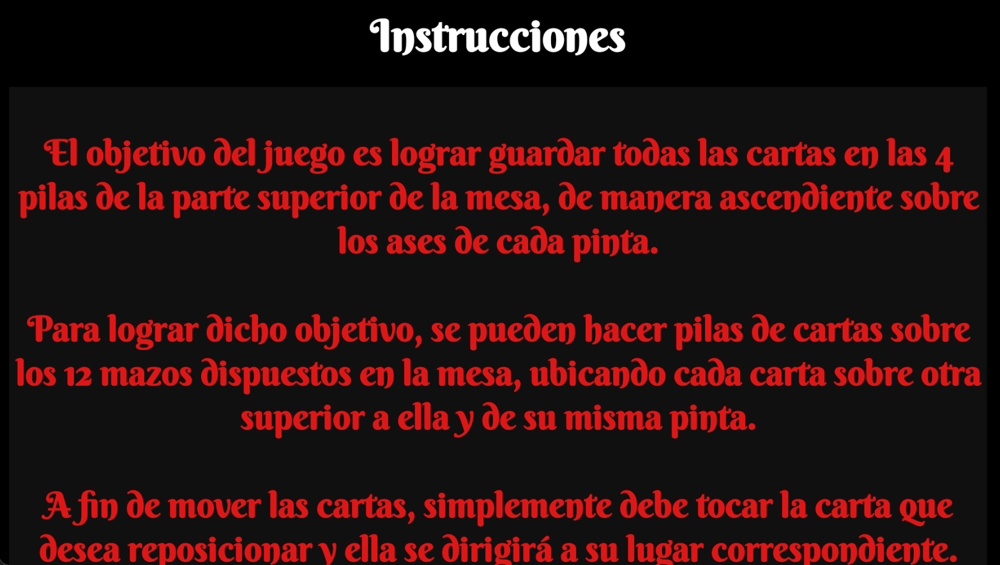
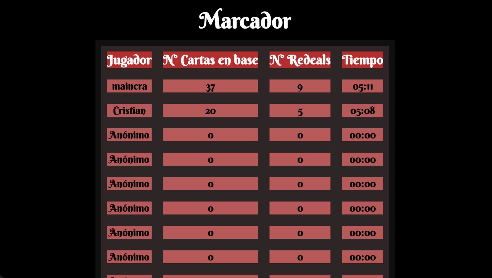
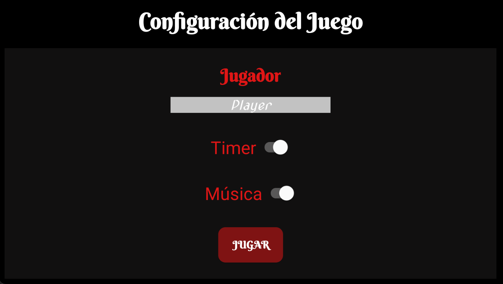
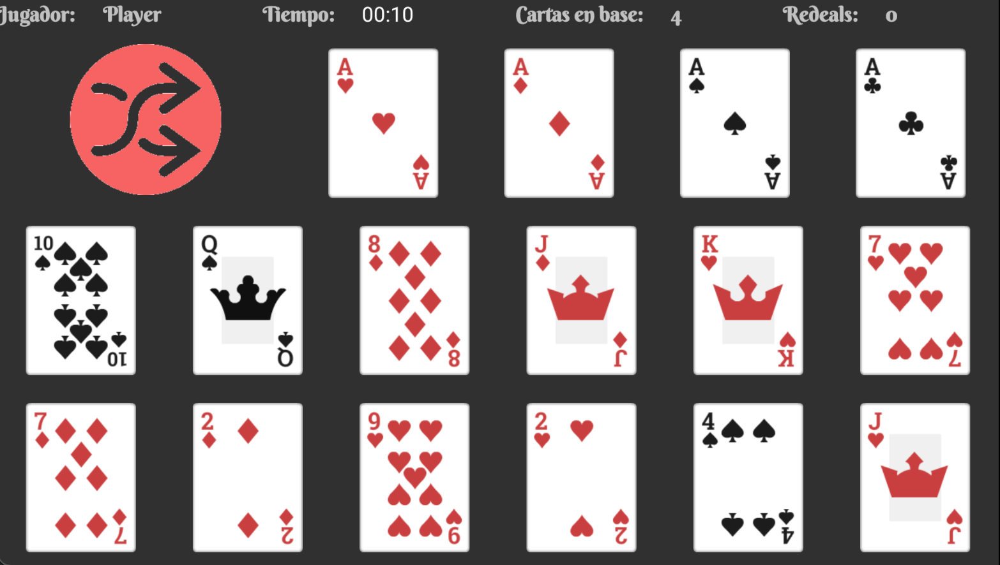
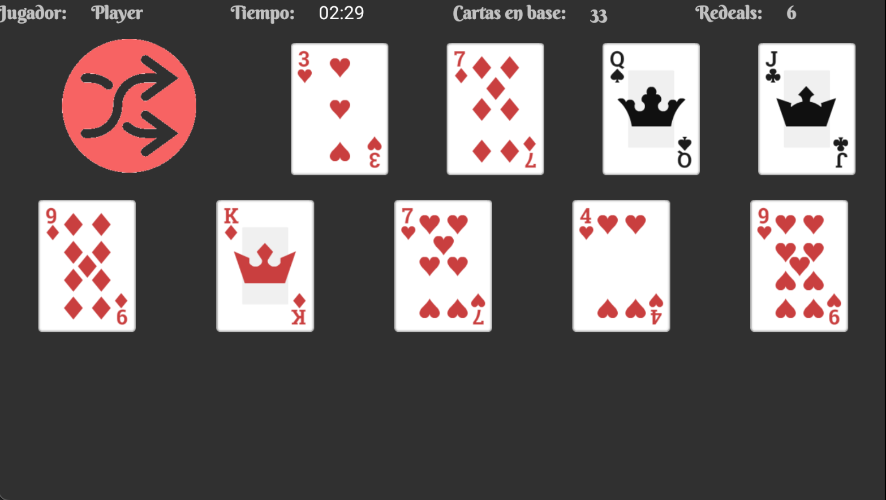
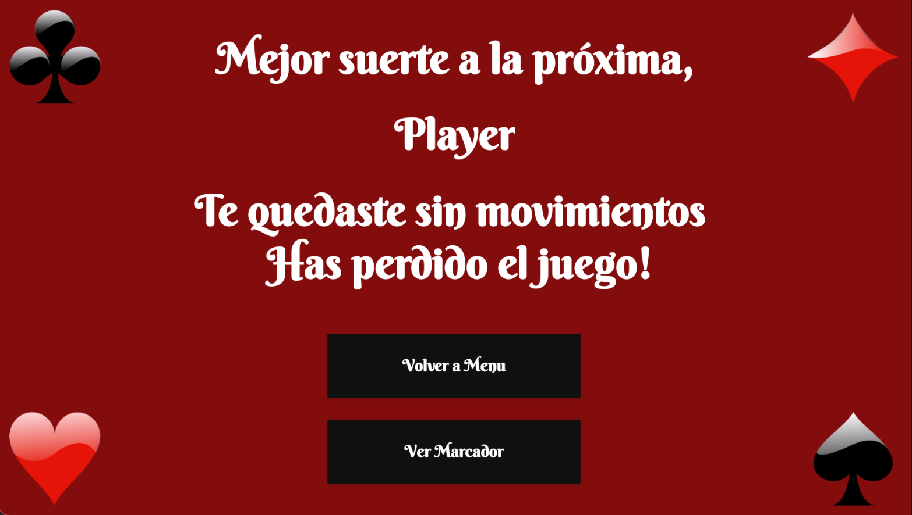

<h2 align="center">Cruel Solitaire</h2>
<h3 align="center">College Project - Mobile App Development - July 2019</h3>

   
  
  
  

---

 Cruel Solitaire game for Android devices.
      

Spanish Language

---
## 📝 Table of Contents
- [Introduction](#introduction)
- [Built With](#built_with)
- [App Details](#app_details)
- [Flowchart](#flowchart)
- [Classes and Methods](#classes_and_methods)
- [Screenshots](#screenshots)
- [Authors](#authors)
<!--- [Deployment](#deployment)-->
<!--
- [TODO](../TODO.md)
- [Contributing](../CONTRIBUTING.md)
- [Authors](#authors)
- [Acknowledgments](#acknowledgement)
-->

---
## 🧐 Introduction 
Cruel Solitaire consists of a variant of the classic Solitaire card game called Cruel Solitaire, which is a card game that uses a standard deck of 52 cards. 

In this game, the aces are placed face up in four bases at the top of the table, in which the sequence of each pint will be stored. The rest of the cards are randomly dealt into 12 piles, with 4 cards each. 

The objective of the game is to place all the cards on the bases, ordered from the ace to the king respecting the pints. 

---
## ⛏️ Built With 
- [Android Studio](https://developer.android.com/studio) - Tools for building Android apps
- [SQLite](https://www.sqlite.org/index.html) - Lightweight SQL database engine
- [Java](https://www.java.com/en/) - Programming language
- [XML](https://github.com/react-native-async-storage/async-storage) -  Markup Language

---
## 💡 App Details 
This application focuses on giving the user the opportunity to play the variant of the classic card game called Cruel Solitaire. 
It has a friendly interface for the user, so that he can easily play and enjoy a game of this game, presenting music, sounds and images that make it attractive to the player. 

When starting the application, a menu is presented in which through buttons it is possible to display the instructions for users who are not familiar with the game. 

From this menu it is also possible to access the credits of the development of the application, which contains the developers and information about the course and date. 

Apart from these screens, through another button it is also possible to access a classification table, which displays the best scores with their respective players, number of cards that they successfully placed on the bases, number of "redeals" made during the game and time. 

Finally in the menu is the option "Play", which leads to a configuration screen of the game to start, in which the player enters the username with which he wants to be known, chooses if he wants the time to be shown on the screen. 

He has been trying to solve the solitaire and also gives the option if he wants background music while playing, in order to offer a more personalized game. Once the game is configured, the user must press "Play" to start the game.

When playing, the user has the opportunity to see the time elapsed since the start of the game, if he selected the option to see this time. Also at the top of the screen there is a "redeals" counter, a card counter located at the base and the name of the current player.

Regarding graphic themes, the application is designed in horizontal orientation, so that the user has a better view of the cards and more space to carry out their movements. 

ScrollViews were implemented in the Instructions, Credits and Table of Positions activities, which allows a fluid interaction of the user with the interface and improves the view of all the elements on the screen. 

In addition, it should be noted that sound was implemented in the movement of the cards, either when moving or shuffling them; Sound was also introduced to buttons and screens when winning or losing. 

---
## 🧭 Flowchart 
The following diagram illustrates the general operation flow of the application. *Diagram in Spanish*

 

---

## 📷 Screenshots 

    
    

 

    
    

 

    
    

 

    
    

 

---
## 🧮 Classes and Methods 

### Classes

The java classes, along with their xml graphical description files, that were created in order to build the application and for the game to function properly are as follows:

#### **MainActivity**
It is the main activity of the application, and corresponds to the menu, from where you can access the other activities of the application. Its xml has a title and 4 buttons: "PLAY", "MARKER", "INSTRUCTIONS" and "CREDITS", whose listener methods that respond to your clicks, open respectively ConfigActivity, MarcadorActivity, InstrucActivity and CreditsActivity.

#### **Card**
It is the class that is implemented in the game to be used as a card. It has properties such as the type of card, the color, the color and its number. It also has useful functions for an agile handling of this type of objects in the implementation of the game, for example the function: toString (), which returns all the card data in a String.

#### **ConfigActivity**
It is the activity that appears when you press "PLAY" in the main menu, prior to starting the game. This activity offers the user the option of choosing a configuration for the game, such as the username, to collect their score and place it in the leaderboard (if no name is given, it automatically leaves the user as anonymous); the elapsed time, if you want it to be visible while playing or not; and background music, which can be skipped from this option to play silently. 

All those options and buttons are distributed in your xml (activity_config.xml). Once the user is happy with their configuration, they can start their game by pressing "PLAY", which will open the GameActivity.

#### **DBHelper**
It is an auxiliary class in order to make easier the handling of the data table "Scores" created with the application, which stores all the information of the scores and times achieved by the different players of the game on the device. mobile. 

This class is an intermediary and is called both to create said database, and to retrieve or update information from it from the other classes of the program. It does this through Strings with the direct statements that must be entered into SQLite, in order to create, enter, delete or retrieve from the database. 

Its main methods are to enter data from the players "addJugador ()", called from GameActivity, when a player finishes his game, and retrieve the best 10 scores "getTopJugadores ()", called from the ActivityMarcador class, to make a display of said information. This last method is done by asking the base for 10 entries, ordered from the number of cards in the base in descending order, then by the least amount of redeals made and finally by the least amount of time obtained. 

It is important to note that the database is initially created with 10 anonymous player records with a score of 0.

#### **MarcadorActivity**
 This activity retrieves information from the application database, with the help of DBHelper. Its graphical interface (activity_marcador) consists of a TableView, where the best 10 Cruel Solitaire players and their respective scores are displayed. 
 
 The information is collected with the getTopJugadores () method of the auxiliary class of the database, obtaining the names, scores and times of each one and ordering them from best to worst and then it is displayed on a table, which is inside a ScrollView, for better visibility of the information. The data is updated each time the bookmark is opened.

#### **GameActivity**
It is the activity in charge of the game, which executes it, displays it on the screen and saves its data in the database to later show the scores in the scoreboard table. 

At the start of the game, a timer starts its count to measure the time it takes the player to win or lose the game. In this activity the user can play by pressing the ImageButtons corresponding to the 12 decks, in order to move the cards accordingly. As the user moves cards in the bases, the card counter in bases is updated. Furthermore, when pressing and performing an effective redeal, the counter for this action increases. 

Finally, if the player wins the game or has no more moves left and loses, the statistics of his game are saved and stored in the database, to be later placed in the scoreboard according to his performance.

#### **InstrucActivity**
It is the activity that opens when pressing “INSTRUCTIONS”. This activity contains the game instructions for the user, about a ScrollView. Pressing the top of the screen returns you to the main menu. 

#### **CreditsActivity**
It is the activity that shows the application developers, as well as the specifications of the course for which the application was made. This is on a ScrollView, for a better distribution of the elements. To return to the menu, press the top of the screen.

#### **EndActivity**
It is the activity that arises when the player ends his game, either by winning or losing. This activity displays a message to the user calling him by his username, congratulating him or wishing him better luck in the future, as appropriate. It also has two buttons giving you the option to return to the main menu or view the table of markers, which open the respective activities. 

### Game Methods

- **startGame()**: Calls the startDeck (), shuffleCards (), dealCards (), paint () and timer.start () functions.
- **startDeck()**: An ordered deck of cards is created and aces are dealt on the bases.
- **shuffleCards()**: The cards are shuffled.
- **dealCards()**: The cards are dealt in the 12 decks of the game.
- **isFinish()**: Check if the player completed all 4 bases and won the game.
- **canMoveToStack(Card)**: Check if a certain card can be moved to a base.
- **canMoveToDeck(Card)**: Check if a certain card can be moved to a deck.
- **anymoveleft()**: Check if there is any possible move in the current position of the game.
- **onredeal()**: Performs the correct algorithm to redistribute the cards from the decks, complying with the rules of the game.
- **ondeck1()**, **ondeck2()**, **ondeck3()**, **ondeck4()**, **ondeck5()**, **ondeck6()**, **ondeck7()**, **ondeck8()**, **ondeck9()**, **ondeck10()**, **ondeck11()**, **ondeck12()**: Correspond to the onClick functions of each of the 12 ImageButtons corresponding to the decks. These functions check if the visible card of the deck, that is, the top card, can be moved to a pile or a deck and performs this movement, in case of power. 

---

<!--## 🚀 Deployment 
Add additional notes about how to deploy this on a live system.
-->

## ✍️ Authors 
- [@crisemcon](https://github.com/crisemcon)
- [@cpezo](https://github.com/cpezo)

<!--

See also the list of [contributors](https://github.com/kylelobo/The-Documentation-Compendium/contributors) who participated in this project. 

## 🎉 Acknowledgements 
- Hat tip to anyone whose code was used
- Inspiration
- References

-->